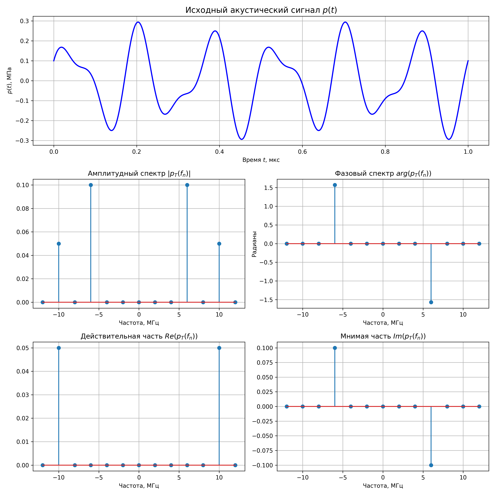

# Самостоятельная работа: Дискретное преобразование Фурье
**Вариант 1**

## Аналитический расчет коэффициентов ряда Фурье


* Амплитуда: $a_0 = 0.1$ МПа
* Базовая частота: $f_0 = 2$ МГц
* Круговая частота: $\omega_0 = 2\pi f_0$
* Сигнал: $p(t) = 2a_0 \sin(3\omega_0 t) + a_0 \cos(5\omega_0 t)$

### Определение периода $T$
Сигнал состоит из двух гармоник с частотами $f_1 = 3f_0 = 6$ МГц и $f_2 = 5f_0 = 10$ МГц. Базовая частота (наибольший общий делитель) равна $f_0 = 2$ МГц. 
Следовательно, период сигнала $T$ равен:
$$ T = \frac{1}{f_0} = \frac{1}{2 \cdot 10^6} = 0.5 \text{ мкс} $$

### Расчет аналитических коэффициентов спектра $p_T(f_n)$
Используем формулы Эйлера для представления тригонометрических функций через комплексные экспоненты:
$$ \sin(x) = \frac{e^{ix} - e^{-ix}}{2i} = -\frac{i}{2}e^{ix} + \frac{i}{2}e^{-ix} $$
$$ \cos(x) = \frac{e^{ix} + e^{-ix}}{2} = \frac{1}{2}e^{ix} + \frac{1}{2}e^{-ix} $$

Подставим эти выражения в исходный сигнал $p(t)$:
$$ p(t) = 2(0.1) \left[ -\frac{i}{2}e^{i 3\omega_0 t} + \frac{i}{2}e^{-i 3\omega_0 t} \right] + 0.1 \left[ \frac{1}{2}e^{i 5\omega_0 t} + \frac{1}{2}e^{-i 5\omega_0 t} \right] $$
$$ p(t) = -0.1i \cdot e^{i 3\omega_0 t} + 0.1i \cdot e^{-i 3\omega_0 t} + 0.05 \cdot e^{i 5\omega_0 t} + 0.05 \cdot e^{-i 5\omega_0 t} $$

Из полученного выражения напрямую следуют аналитические значения комплексных коэффициентов спектра $p_T(f_n)$ на частотах $f_n$:

* На частоте **$3f_0$ (6 МГц):** $p_T(3f_0) = -0.1i$ (Действ: 0, Мнимая: -0.1, Амплитуда: 0.1, Фаза: $-\pi/2$)
* На частоте **$-3f_0$ (-6 МГц):** $p_T(-3f_0) = 0.1i$ (Действ: 0, Мнимая: 0.1, Амплитуда: 0.1, Фаза: $\pi/2$)
* На частоте **$5f_0$ (10 МГц):** $p_T(5f_0) = 0.05$ (Действ: 0.05, Мнимая: 0, Амплитуда: 0.05, Фаза: 0)
* На частоте **$-5f_0$ (-10 МГц):** $p_T(-5f_0) = 0.05$ (Действ: 0.05, Мнимая: 0, Амплитуда: 0.05, Фаза: 0)

### Графики функции и аналитического спектра

Свойства симметрии: так как исходный сигнал $p(t)$ является действительной функцией, его амплитудный и действительный спектры являются четными функциями (симметричны относительно оси ординат), а фазовый и мнимый спектры — нечетными функциями (симметричны относительно начала координат).



### Код
```python
import numpy as np
import matplotlib.pyplot as plt

a0 = 0.1 # MPa
f0 = 2.0 # MHz
w0 = 2 * np.pi * f0
T = 1 / f0 # microseconds

t = np.linspace(0, 2*T, 1000)
p_t = 2 * a0 * np.sin(3 * w0 * t) + a0 * np.cos(5 * w0 * t)

freqs_f0_multipliers = np.arange(-6, 7) 
freqs = freqs_f0_multipliers * f0

coeffs = np.zeros(len(freqs), dtype=complex)

coeffs[freqs_f0_multipliers == 3] = -0.1j
coeffs[freqs_f0_multipliers == -3] = 0.1j
coeffs[freqs_f0_multipliers == 5] = 0.05
coeffs[freqs_f0_multipliers == -5] = 0.05

amplitude = np.abs(coeffs)
phase = np.angle(coeffs)
real_part = np.real(coeffs)
imag_part = np.imag(coeffs)

fig = plt.figure(figsize=(12, 12))

plt.subplot(3, 1, 1)
plt.plot(t, p_t, 'b-', linewidth=2)
plt.title('Исходный акустический сигнал $p(t)$', fontsize=14)
plt.xlabel('Время $t$, мкс')
plt.ylabel('$p(t)$, МПа')
plt.grid(True)


plt.subplot(3, 2, 3)
plt.stem(freqs, amplitude)
plt.title('Амплитудный спектр $|p_T(f_n)|$')
plt.xlabel('Частота, МГц')
plt.grid(True)

plt.subplot(3, 2, 4)
plt.stem(freqs, phase)
plt.title('Фазовый спектр $arg(p_T(f_n))$')
plt.xlabel('Частота, МГц')
plt.ylabel('Радианы')
plt.grid(True)

# Действительная и мнимая части
plt.subplot(3, 2, 5)
plt.stem(freqs, real_part)
plt.title('Действительная часть $Re(p_T(f_n))$')
plt.xlabel('Частота, МГц')
plt.grid(True)

plt.subplot(3, 2, 6)
plt.stem(freqs, imag_part)
plt.title('Мнимая часть $Im(p_T(f_n))$')
plt.xlabel('Частота, МГц')
plt.grid(True)

plt.tight_layout()
plt.savefig('fig_1.png', dpi=300)

```
