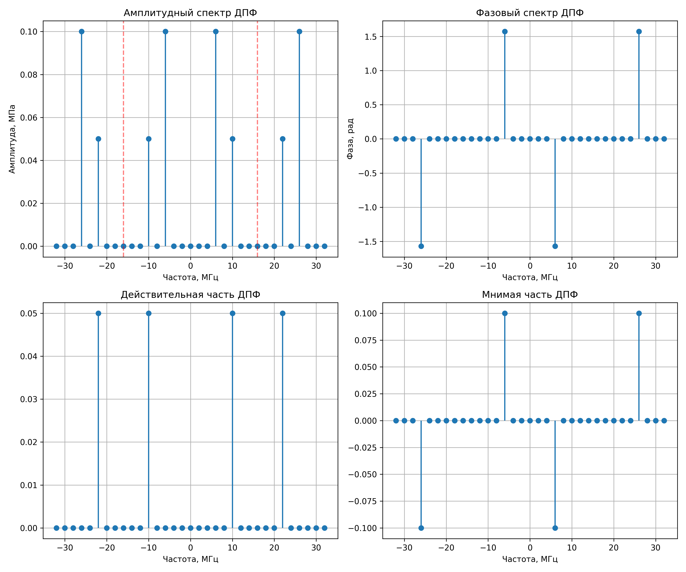

## 3. Программная реализация ДПФ

В данном разделе реализуется алгоритм ДПФ для вычисления спектра сеточной функции $p(l)$ строго по формуле (3) из задания.

### 3.1 Использование свойств симметрии
Поскольку исходный акустический сигнал $p(t)$ является действительной функцией, его спектр обладает эрмитовой симметрией. Это означает, что для $N$-точечного ДПФ:
$$ p_T(N - n) = p_T^*(n) $$
где $*$ обозначает комплексное сопряжение. 

Это свойство позволяет сократить объем вычислений вдвое: мы вычисляем спектральные коэффициенты $p_T(n)$ по формуле суммы только для первой половины спектра (от $n = 0$ до $n = N/2$), а вторую половину получаем операцией комплексного сопряжения.

### 3.2 Коэффициент масштабирования
В задании требуется пояснить коэффициент масштабирования для совпадения амплитуд. 
Связь между аналитическим интегралом Фурье и дискретной суммой выражается через метод прямоугольников для численного интегрирования:
$$ p_T(f_n) = \frac{1}{T} \int_0^T p(t) e^{-i 2\pi f_n t} dt \approx \frac{1}{T} \sum_{l=0}^{N-1} p(l \cdot h) e^{-i \frac{2\pi n l}{N}} \cdot h $$

Так как $T = N \cdot h$, то $\frac{h}{T} = \frac{1}{N}$. Следовательно:
$$ p_T(f_n) \approx \frac{1}{N} \sum_{l=0}^{N-1} p(l) e^{-i \frac{2\pi n l}{N}} $$

Формула (3), приведенная в методичке, **уже содержит** этот нормировочный множитель $\frac{1}{N}$. Поэтому спектр, рассчитанный по этой формуле, не требует дополнительного масштабирования — его амплитуды численно совпадут с амплитудами аналитического спектра из пункта 1 (0.1 МПа и 0.05 МПа).

### 3.3 Построение графиков
Согласно заданию, графики построены в расширенном интервале от $-1/h$ до $1/h$ (т.е. от $-f_s$ до $f_s$). ДПФ обладает свойством периодичности с периодом $N$ (в частотной области это соответствует периоду $f_s$), поэтому спектр за пределами диапазона $[0, f_s)$ является циклическим повторением базового интервала.



Сравнивая полученные амплитуды (0.1 на 6 МГц и 0.05 на 10 МГц) с графиком из пункта 1, можно убедиться, что дискретные и аналитические значения совпадают абсолютно точно.


### 3.4 Код

```python
import numpy as np
import matplotlib.pyplot as plt


a0 = 0.1  # MPa
f0 = 2.0  # MHz
w0 = 2 * np.pi * f0
T = 0.5  # мкс
N = 16   # points
h = T / N  # 0.03125 microseconds
fs = 1 / h  # 32 MHz


l_indices = np.arange(N)
t_l = l_indices * h
p_l = 2 * a0 * np.sin(3 * w0 * t_l) + a0 * np.cos(5 * w0 * t_l)

p_T_discrete = np.zeros(N, dtype=complex)

half_N = N // 2
for n in range(half_N + 1):
    sum_val = 0j
    for l in range(N):
        exponent = -1j * 2 * np.pi * n * l / N
        sum_val += p_l[l] * np.exp(exponent)
    p_T_discrete[n] = sum_val / N


for n in range(half_N + 1, N):
    p_T_discrete[n] = np.conj(p_T_discrete[N - n])

n_extended = np.arange(-N, N + 1)
freqs_extended = n_extended * (fs / N)
p_T_extended = p_T_discrete[n_extended % N]

p_T_extended[np.abs(p_T_extended) < 1e-10] = 0

amplitude_ext = np.abs(p_T_extended)
phase_ext = np.angle(p_T_extended)
real_part_ext = np.real(p_T_extended)
imag_part_ext = np.imag(p_T_extended)


fig = plt.figure(figsize=(12, 10))

plt.subplot(2, 2, 1)
plt.stem(freqs_extended, amplitude_ext, basefmt=" ")
plt.title('Амплитудный спектр ДПФ')
plt.xlabel('Частота, МГц')
plt.ylabel('Амплитуда, МПа')
plt.axvline(x=fs/2, color='r', linestyle='--', alpha=0.5)
plt.axvline(x=-fs/2, color='r', linestyle='--', alpha=0.5)
plt.grid(True)

plt.subplot(2, 2, 2)
plt.stem(freqs_extended, phase_ext, basefmt=" ")
plt.title('Фазовый спектр ДПФ')
plt.xlabel('Частота, МГц')
plt.ylabel('Фаза, рад')
plt.grid(True)

plt.subplot(2, 2, 3)
plt.stem(freqs_extended, real_part_ext, basefmt=" ")
plt.title('Действительная часть ДПФ')
plt.xlabel('Частота, МГц')
plt.grid(True)

plt.subplot(2, 2, 4)
plt.stem(freqs_extended, imag_part_ext, basefmt=" ")
plt.title('Мнимая часть ДПФ')
plt.xlabel('Частота, МГц')
plt.grid(True)

plt.tight_layout()
plt.savefig('fig_3.png', dpi=300)

```
