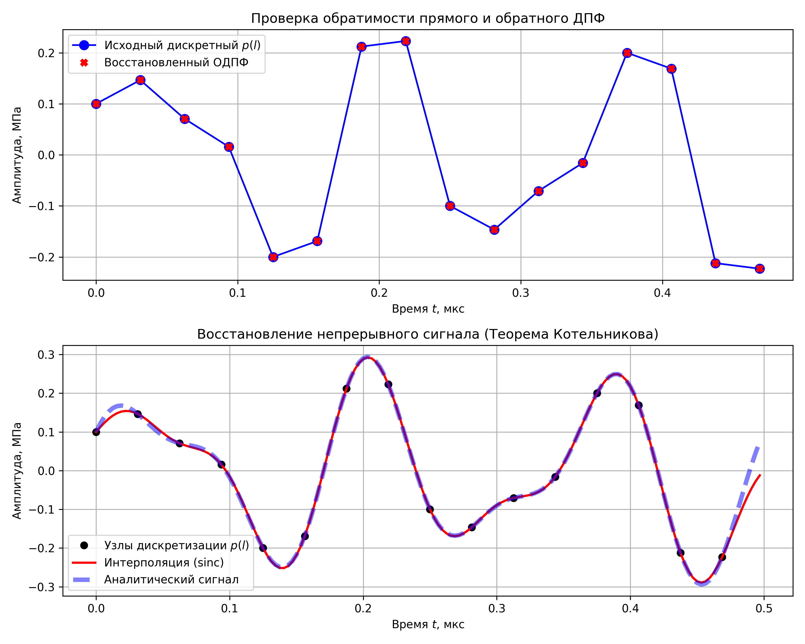

## 4. Обратное ДПФ и интерполяция по теореме Котельникова-Шеннона

В этом разделе решается обратная задача: восстановление временного сигнала из его дискретного спектра (ОДПФ) и реконструкция непрерывной формы сигнала между узлами дискретизации.

### 4.1 Программная реализация обратного ДПФ (ОДПФ)
Вычисление сеточной функции $p(l)$ по найденным амплитудам гармоник проводится по формуле (4):
$$ p(l) = \sum_{n=0}^{N-1} p_T(n) \exp\left( i \frac{2\pi nl}{N} \right) $$

**О проверке обратимости:** 
Поскольку в прямом ДПФ (пункт 3) мы делили сумму на $N$, в формуле обратного ДПФ умножение на $N$ не требуется. Прямое и обратное преобразования формируют строго обратимую пару. Вычисления показывают, что разница между исходным дискретным сигналом $p(l)$ и восстановленным через ОДПФ сигналом близка к машинному нулю (порядка $10^{-16}$). Это подтверждает абсолютную обратимость алгоритма.

### 4.2 Восстановление непрерывного сигнала (Интерполяция Шеннона)
Теорема Котельникова-Шеннона гласит, что любой сигнал, спектр которого ограничен частотой $f_{max}$, может быть абсолютно точно восстановлен из своих дискретных отсчетов, если частота дискретизации $f_s > 2f_{max}$.

Для восстановления непрерывной функции $p(t)$ используется ряд Котельникова (формула 5):
$$ p(t) = \sum_{l=0}^{N-1} p(l) \text{sinc} \left( \frac{\pi}{h} (t - lh) \right) $$

Функция $\text{sinc}(x) = \frac{\sin(x)}{x}$ в частотной области представляет собой идеальный фильтр нижних частот (ФНЧ) прямоугольной формы. Суммирование сдвинутых функций $\text{sinc}$, умноженных на значения выборки $p(l)$, позволяет "сгладить" ступенчатый дискретный сигнал.

*Примечание к программной реализации:* В библиотеке `NumPy` используется нормированная функция `sinc(x)`, которая вычисляется как $\frac{\sin(\pi x)}{\pi x}$. Поэтому при программировании аргумент функции умножать на $\pi$ не нужно, формула принимает вид `numpy.sinc((t - l*h) / h)`.

### 4.3 Графики результатов
Для проверки интерполяции была создана новая временная сетка с шагом $h/10$. Как видно на графике ниже, интерполированная кривая проходит точно через исходные узлы дискретизации и полностью совпадает с исходной аналитической функцией, что наглядно доказывает теорему Котельникова.




### 4.4 Код

```python
import numpy as np
import matplotlib.pyplot as plt


a0 = 0.1
f0 = 2.0
w0 = 2 * np.pi * f0
T = 0.5
N = 16
h = T / N

l_indices = np.arange(N)
t_l = l_indices * h
p_l = 2 * a0 * np.sin(3 * w0 * t_l) + a0 * np.cos(5 * w0 * t_l)

p_T_discrete = np.zeros(N, dtype=complex)
for n in range(N):
    sum_val = 0j
    for l in range(N):
        exponent = -1j * 2 * np.pi * n * l / N
        sum_val += p_l[l] * np.exp(exponent)
    p_T_discrete[n] = sum_val / N


p_restored = np.zeros(N, dtype=complex)
for l in range(N):
    sum_val = 0j
    for n in range(N):
        exponent = 1j * 2 * np.pi * n * l / N
        sum_val += p_T_discrete[n] * np.exp(exponent)
    p_restored[l] = sum_val


p_restored_real = np.real(p_restored)


h_fine = h / 10
t_fine = np.arange(0, T, h_fine)
p_interpolated = np.zeros(len(t_fine))

for idx, t in enumerate(t_fine):
    sum_sinc = 0
    for l in range(N):
        sum_sinc += p_l[l] * np.sinc((t - l * h) / h)
    p_interpolated[idx] = sum_sinc


p_analytical_fine = 2 * a0 * np.sin(3 * w0 * t_fine) + a0 * np.cos(5 * w0 * t_fine)


fig = plt.figure(figsize=(10, 8))

plt.subplot(2, 1, 1)
plt.plot(t_l, p_l, 'bo-', markersize=8, label='Исходный дискретный $p(l)$')
plt.plot(t_l, p_restored_real, 'rX', markersize=6, label='Восстановленный ОДПФ')
plt.title('Проверка обратимости прямого и обратного ДПФ')
plt.xlabel('Время $t$, мкс')
plt.ylabel('Амплитуда, МПа')
plt.grid(True)
plt.legend()

plt.subplot(2, 1, 2)
plt.plot(t_l, p_l, 'ko', markersize=6, label='Узлы дискретизации $p(l)$')
plt.plot(t_fine, p_interpolated, 'r-', linewidth=2, label='Интерполяция (sinc)')
plt.plot(t_fine, p_analytical_fine, 'b--', alpha=0.5, linewidth=4, label='Аналитический сигнал')

plt.title('Восстановление непрерывного сигнала (Теорема Котельникова)')
plt.xlabel('Время $t$, мкс')
plt.ylabel('Амплитуда, МПа')
plt.grid(True)
plt.legend()

plt.tight_layout()
plt.savefig('fig_4.png', dpi=300)
```
