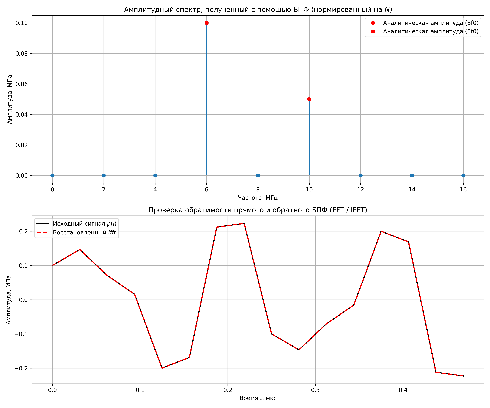

## 5. Использование встроенных функций БПФ (FFT)

В данном разделе для расчета спектра и восстановления сигнала применяются встроенные библиотечные функции быстрого преобразования Фурье (`fft`) и обратного быстрого преобразования Фурье (`ifft`).

### 5.1 Соотношение спектров БПФ и формулы (3)
Вычислим спектр с помощью стандартной функции прямого преобразования:
$$ P_{FFT} = \text{fft}(p(l)) $$

**Определение соотношения:** 
Сравнивая полученный спектр $P_{FFT}$ со спектром $p_T(n)$, рассчитанным вручную по формуле (3), можно заметить, что значения амплитуд во встроенной функции ровно в $N$ раз больше (для нашего случая в 16 раз: амплитуды равны 1.6 и 0.8 вместо 0.1 и 0.05).

Это связано с общепринятым стандартом программирования библиотек (в Python NumPy и MATLAB): алгоритм прямого `fft` **не производит** деление на $N$. Сумма вычисляется просто как $\sum p(l) e^{-i...}$. 
Деление на $N$ переносится в функцию обратного преобразования `ifft`, чтобы выполнялось условие полной обратимости без потери энергии.

Таким образом, соотношение между встроенным БПФ и формулой (3) имеет вид:
$$ P_{FFT}(n) = N \cdot p_T(n) $$

Чтобы получить физические (истинные) амплитуды гармоник (как в аналитическом расчете), результат функции `fft` необходимо разделить на размер выборки $N$.

### 5.2 Проверка обратимости БПФ
Для проверки обратимости выполним обратное преобразование полученного БПФ-спектра:
$$ p_{IFFT} = \text{ifft}(P_{FFT}) $$

Результаты вычислений и график наглядно показывают, что восстановленный сигнал $p_{IFFT}$ абсолютно точно совпадает с исходной сеточной функцией $p(l)$. Разница между массивами составляет порядка $10^{-16}$, что является пределом точности вычислений с плавающей запятой (машинным нулем). 

Алгоритмы `fft` и `ifft` составляют строго обратимую пару.




### 5.3 Код


```python
import numpy as np
import matplotlib.pyplot as plt


a0 = 0.1
f0 = 2.0
w0 = 2 * np.pi * f0
T = 0.5
N = 16
h = T / N

l_indices = np.arange(N)
t_l = l_indices * h
p_l = 2 * a0 * np.sin(3 * w0 * t_l) + a0 * np.cos(5 * w0 * t_l)


P_fft_raw = np.fft.fft(p_l)


P_fft_normalized = P_fft_raw / N
amplitude_fft = np.abs(P_fft_normalized)


fs = 1 / h
freqs_fft = np.arange(N) * (fs / N)


p_ifft = np.fft.ifft(P_fft_raw)
p_ifft_real = np.real(p_ifft)


fig = plt.figure(figsize=(12, 10))

plt.subplot(2, 1, 1)

half_N = N // 2 + 1
plt.stem(freqs_fft[:half_N], amplitude_fft[:half_N], basefmt=" ",)

plt.plot(6.0, 0.1, 'ro', label='Аналитическая амплитуда (3f0)')
plt.plot(10.0, 0.05, 'ro', label='Аналитическая амплитуда (5f0)')

plt.title('Амплитудный спектр, полученный с помощью БПФ (нормированный на $N$)')
plt.xlabel('Частота, МГц')
plt.ylabel('Амплитуда, МПа')
plt.grid(True)
plt.legend()

plt.subplot(2, 1, 2)
plt.plot(t_l, p_l, 'k-', linewidth=2, label='Исходный сигнал $p(l)$')
plt.plot(t_l, p_ifft_real, 'r--', linewidth=2, label='Восстановленный $ifft$')
plt.title('Проверка обратимости прямого и обратного БПФ (FFT / IFFT)')
plt.xlabel('Время $t$, мкс')
plt.ylabel('Амплитуда, МПа')
plt.grid(True)
plt.legend()

plt.tight_layout()
plt.savefig('fig_5.png', dpi=300)

```
