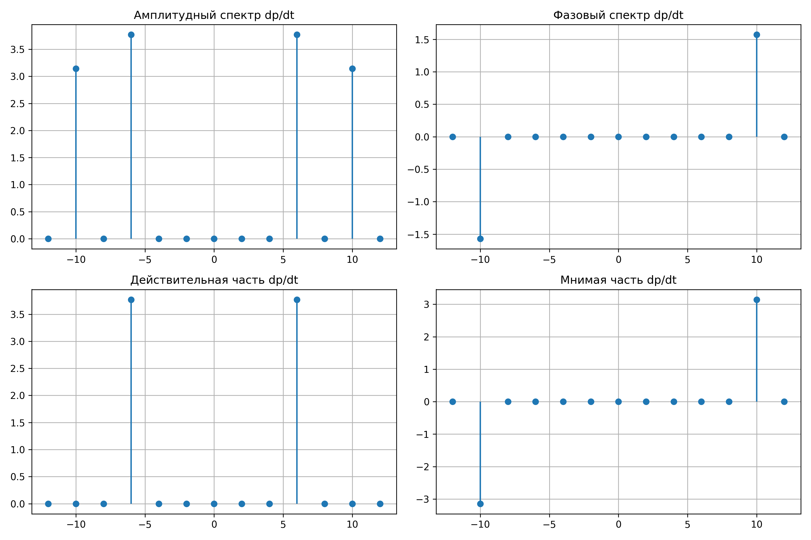
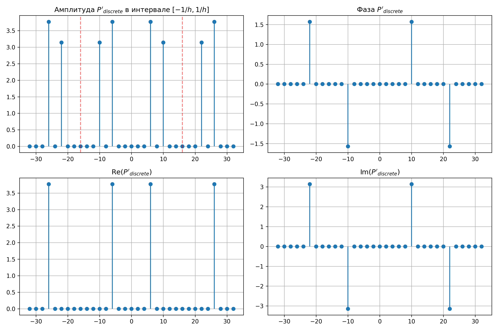
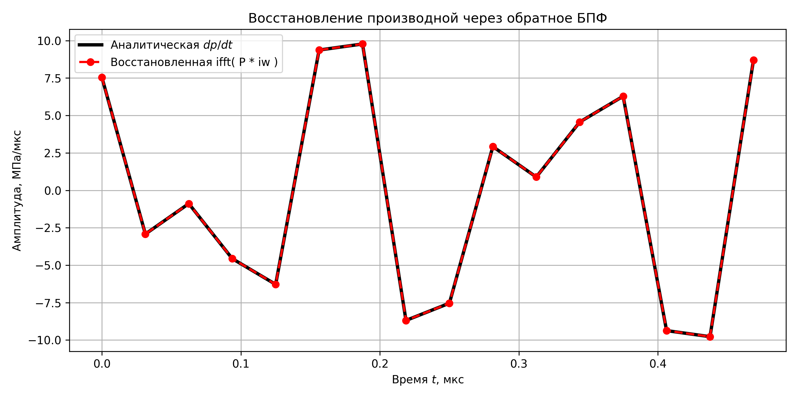

# Дополнительное задание

## Аналитический расчет спектра производной

По свойствам преобразования Фурье, дифференцирование сигнала во временной области эквивалентно умножению его спектра на $i \omega$ (или $i 2\pi f_n$) в частотной области:
$$ \frac{dp(t)}{dt} \longleftrightarrow i 2\pi f_n \cdot P(f_n) = i \omega_n \cdot P(\omega_n) $$

Найдем производную аналитически:
$$ p(t) = 2a_0 \sin(3\omega_0 t) + a_0 \cos(5\omega_0 t) = 0.2 \sin(3\omega_0 t) + 0.1 \cos(5\omega_0 t) $$
$$ \frac{dp(t)}{dt} = 0.2 \cdot 3\omega_0 \cos(3\omega_0 t) - 0.1 \cdot 5\omega_0 \sin(5\omega_0 t) = 0.6\omega_0 \cos(3\omega_0 t) - 0.5\omega_0 \sin(5\omega_0 t) $$

Применим свойство к аналитическим коэффициентам из п.1. (где $\omega_0 = 2\pi f_0 = 4\pi \text{ Мрад/с}$):
*   На частоте **$3f_0$ (6 МГц):** $C'_3 = i(2\pi \cdot 3f_0) \cdot (-0.1i) = 0.6\pi f_0 = 1.2\pi \approx 3.77$ (Чисто действительное)
*   На частоте **$-3f_0$ (-6 МГц):** $C'_{-3} = i(2\pi \cdot (-3f_0)) \cdot (0.1i) = 0.6\pi f_0 = 1.2\pi \approx 3.77$
*   На частоте **$5f_0$ (10 МГц):** $C'_5 = i(2\pi \cdot 5f_0) \cdot 0.05 = i \cdot 0.5\pi f_0 = i \pi \approx 3.14 i$ (Чисто мнимое)
*   На частоте **$-5f_0$ (-10 МГц):** $C'_{-5} = i(2\pi \cdot (-5f_0)) \cdot 0.05 = -i \cdot 0.5\pi f_0 = -i \pi \approx -3.14 i$


Производная действительного сигнала также является действительным сигналом. Поэтому спектр сохраняет эрмитову симметрию: действительная часть спектра и амплитуда — четные функции ($C'_3 = C'_{-3}$), а мнимая часть и фаза — нечетные функции ($C'_5 = -C'_{-5}$). Умножение на $i$ привело к тому, что гармоники, бывшие чисто мнимыми, стали действительными, и наоборот.



## Расчет дискретного спектра производной из спектра сигнала

Для получения спектра производной из дискретного спектра $P_{discrete}(n)$ (рассчитанного в п. 3) необходимо каждый отсчет умножить на $i 2\pi f_n$. 

**Особенность нумерации дискретных частот:**
В дискретном спектре индексы $n$ от $0$ до $N/2$ соответствуют положительным частотам, а индексы от $N/2$ до $N-1$ представляют область отрицательных частот. Чтобы корректно применить множитель $i \omega$, необходимо ввести масштабирование частоты — пересчитать индекс $n$ в истинную физическую частоту:
*   Для $0 \le n \le N/2$: $f_{mapped} = n \cdot \frac{f_s}{N}$
*   Для $N/2 < n \le N-1$: $f_{mapped} = (n - N) \cdot \frac{f_s}{N}$

Таким образом, спектр производной рассчитывается как: 
$$ P'_{discrete}(n) = P_{discrete}(n) \cdot \left( i 2\pi f_{mapped}(n) \right) $$

Сравнивая полученные графики с графиками из п.1*, видим полное совпадение значений (амплитуды $3.77$ и $3.14$), что подтверждает правильность введенного частотного масштабирования.



## Расчет спектра производной с использованием БПФ (FFT / IFFT)

В данном разделе применяется описанный выше алгоритм, но с использованием встроенных функций MATLAB/Python:
1. Вычисляется спектр сигнала: $P = \text{fft}(p)$
2. Формируется вектор круговых частот $\omega_{vec}$ с учетом отрицательной полуоси (функция `fftfreq`).
3. Вычисляется спектр производной: $P'_{FFT} = P \cdot (i \omega_{vec})$
4. Восстанавливается сигнал во временной области: $p'_{IFFT} = \text{ifft}(P'_{FFT})$

На графике ниже представлено сравнение восстановленной через IFFT производной и точного аналитического решения для $dp/dt$. Кривые совпадают с машинной точностью, что доказывает полную работоспособность метода спектрального дифференцирования в дискретном виде.




### Код

```python
import numpy as np
import matplotlib.pyplot as plt

a0 = 0.1
f0 = 2.0
w0 = 2 * np.pi * f0 # 4*/pi
T = 0.5
N = 16
h = T / N
fs = 1 / h


l_indices = np.arange(N)
t_l = l_indices * h
p_l = 2 * a0 * np.sin(3 * w0 * t_l) + a0 * np.cos(5 * w0 * t_l)

# 1
freqs_f0_multipliers = np.arange(-6, 7) 
freqs = freqs_f0_multipliers * f0


coeffs_deriv = np.zeros(len(freqs), dtype=complex)
coeffs_deriv[freqs_f0_multipliers == 3] = 0.6 * np.pi * f0 # 1.2 * /pi
coeffs_deriv[freqs_f0_multipliers == -3] = 0.6 * np.pi * f0
coeffs_deriv[freqs_f0_multipliers == 5] = 1j * 0.5 * np.pi * f0 # 1j * /pi
coeffs_deriv[freqs_f0_multipliers == -5] = -1j * 0.5 * np.pi * f0

fig = plt.figure(figsize=(12, 8))
plt.subplot(2, 2, 1)
plt.stem(freqs, np.abs(coeffs_deriv), basefmt=" ")
plt.title('Амплитудный спектр dp/dt')
plt.grid(True)

plt.subplot(2, 2, 2)
plt.stem(freqs, np.angle(coeffs_deriv), basefmt=" ")
plt.title('Фазовый спектр dp/dt')
plt.grid(True)

plt.subplot(2, 2, 3)
plt.stem(freqs, np.real(coeffs_deriv), basefmt=" ")
plt.title('Действительная часть dp/dt')
plt.grid(True)

plt.subplot(2, 2, 4)
plt.stem(freqs, np.imag(coeffs_deriv), basefmt=" ")
plt.title('Мнимая часть dp/dt')
plt.grid(True)
plt.tight_layout()
plt.savefig('fig_add_1.png', dpi=300)
plt.close()


# 2
p_T_discrete = np.zeros(N, dtype=complex)
for n in range(N):
    sum_val = 0j
    for l in range(N):
        exponent = -1j * 2 * np.pi * n * l / N
        sum_val += p_l[l] * np.exp(exponent)
    p_T_discrete[n] = sum_val / N


freqs_mapped = np.zeros(N)
for n in range(N):
    if n <= N//2:
        freqs_mapped[n] = n * (fs / N)
    else:
        freqs_mapped[n] = (n - N) * (fs / N)

omega_mapped = 2 * np.pi * freqs_mapped

p_T_deriv_discrete = p_T_discrete * (1j * omega_mapped)

n_extended = np.arange(-N, N + 1)
freqs_extended = n_extended * (fs / N)
p_T_deriv_extended = p_T_deriv_discrete[n_extended % N]
p_T_deriv_extended[np.abs(p_T_deriv_extended) < 1e-10] = 0  # get rid of noise

fig = plt.figure(figsize=(12, 8))
plt.subplot(2, 2, 1)
plt.stem(freqs_extended, np.abs(p_T_deriv_extended), basefmt=" ")
plt.title('Амплитуда $P\'_{discrete}$ в интервале $[-1/h, 1/h]$')
plt.axvline(x=fs/2, color='r', linestyle='--', alpha=0.5)
plt.axvline(x=-fs/2, color='r', linestyle='--', alpha=0.5)
plt.grid(True)

plt.subplot(2, 2, 2)
plt.stem(freqs_extended, np.angle(p_T_deriv_extended), basefmt=" ")
plt.title('Фаза $P\'_{discrete}$')
plt.grid(True)

plt.subplot(2, 2, 3)
plt.stem(freqs_extended, np.real(p_T_deriv_extended), basefmt=" ")
plt.title('Re($P\'_{discrete}$)')
plt.grid(True)

plt.subplot(2, 2, 4)
plt.stem(freqs_extended, np.imag(p_T_deriv_extended), basefmt=" ")
plt.title('Im($P\'_{discrete}$)')
plt.grid(True)
plt.tight_layout()
plt.savefig('fig_add_2.png', dpi=300)
plt.close()


# 3*
P_fft = np.fft.fft(p_l)

freqs_fft = np.fft.fftfreq(N, d=h) 
omega_fft = 2 * np.pi * freqs_fft

P_deriv_fft = P_fft * (1j * omega_fft)

p_deriv_ifft = np.fft.ifft(P_deriv_fft)
p_deriv_ifft_real = np.real(p_deriv_ifft)

# dp/dt = 0.6 * w0 * cos(3*w0*t) - 0.5 * w0 * sin(5*w0*t)
p_deriv_analytical = 0.6 * w0 * np.cos(3 * w0 * t_l) - 0.5 * w0 * np.sin(5 * w0 * t_l)

fig = plt.figure(figsize=(10, 5))
plt.plot(t_l, p_deriv_analytical, 'k-', linewidth=3, label='Аналитическая $dp/dt$')
plt.plot(t_l, p_deriv_ifft_real, 'r--', marker='o', markersize=6, linewidth=2, label='Восстановленная ifft( P * iw )')
plt.title('Восстановление производной через обратное БПФ')
plt.xlabel('Время $t$, мкс')
plt.ylabel('Амплитуда, МПа/мкс')
plt.legend()
plt.grid(True)
plt.tight_layout()
plt.savefig('fig_add_3.png', dpi=300)
plt.close()

````