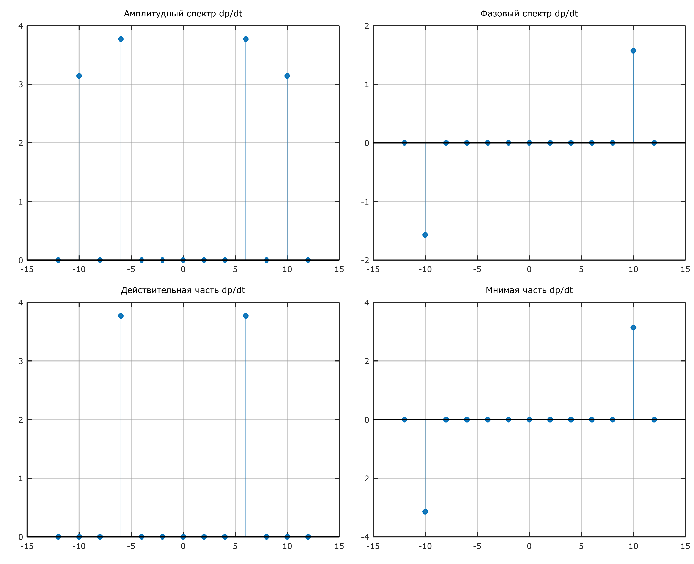
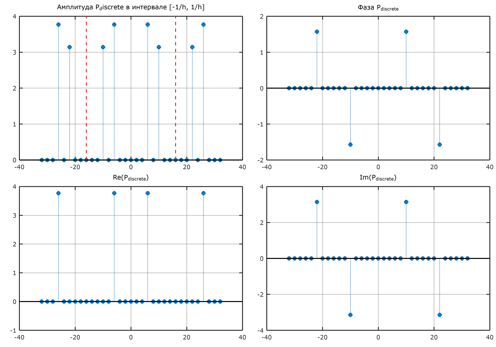

# Дополнительное задание

## Аналитический расчет спектра производной

По свойствам преобразования Фурье, дифференцирование сигнала во временной области эквивалентно умножению его спектра на $i \omega$ (или $i 2\pi f_n$) в частотной области:
$$ \frac{dp(t)}{dt} \longleftrightarrow i 2\pi f_n \cdot P(f_n) = i \omega_n \cdot P(\omega_n) $$

Найдем производную аналитически:
$$ p(t) = 2a_0 \sin(3\omega_0 t) + a_0 \cos(5\omega_0 t) = 0.2 \sin(3\omega_0 t) + 0.1 \cos(5\omega_0 t) $$
$$ \implies \frac{dp(t)}{dt} = 0.2 \cdot 3\omega_0 \cos(3\omega_0 t) - 0.1 \cdot 5\omega_0 \sin(5\omega_0 t) = 0.6\omega_0 \cos(3\omega_0 t) - 0.5\omega_0 \sin(5\omega_0 t) $$

Применим свойство к аналитическим коэффициентам из п.1.:

$$
\begin{aligned}
& 3f_0 (6 МГц): C'_3 = i(2\pi \cdot 3f_0) \cdot (-0.1i) = 0.6\pi f_0 = 1.2\pi \approx 3.77 & \text{(Чисто действительное)} \\
& -3f_0 (-6 МГц): C'_{-3} = i(2\pi \cdot (-3f_0)) \cdot (0.1i) = 0.6\pi f_0 = 1.2\pi \approx 3.77 \\
&5f_0 (10 МГц): C'_5 = i(2\pi \cdot 5f_0) \cdot 0.05 = i \cdot 0.5\pi f_0 = i \pi \approx 3.14 i & \text{(Чисто мнимое)} \\
&-5f_0 (-10 МГц): C'_{-5} = i(2\pi \cdot (-5f_0)) \cdot 0.05 = -i \cdot 0.5\pi f_0 = -i \pi \approx -3.14 i\\
\end{aligned}
$$


Производная действительного сигнала также является действительным сигналом. Cпектр сохраняет эрмитову симметрию: действительная часть спектра и амплитуда — четные функции ($C'_3 = C'_{-3}$), а мнимая часть и фаза — нечетные функции ($C'_5 = -C'_{-5}$). Умножение на $i$ привело к тому, что гармоники, бывшие чисто мнимыми, стали действительными, и наоборот.



## Расчет дискретного спектра производной из спектра сигнала

Для получения спектра производной из дискретного спектра $P_{discrete}(n)$ (рассчитанного в п. 3) необходимо каждый отсчет умножить на $i 2\pi f_n$. 

В дискретном спектре индексы $n$ от $0$ до $N/2$ соответствуют положительным частотам, а индексы от $N/2$ до $N-1$ представляют область отрицательных частот. Чтобы корректно применить множитель $i \omega$, необходимо ввести масштабирование частоты — пересчитать индекс $n$ в истинную физическую частоту:
*   Для $0 \le n \le N/2$: $f_{mapped} = n \cdot \frac{f_s}{N}$
*   Для $N/2 < n \le N-1$: $f_{mapped} = (n - N) \cdot \frac{f_s}{N}$

Таким образом, спектр производной рассчитывается как: 
$$ P'_{discrete}(n) = P_{discrete}(n) \cdot \left( i 2\pi f_{mapped}(n) \right) $$

Сравнивая полученные графики с графиками из п.1*, видим полное совпадение значений (амплитуды $3.77$ и $3.14$), что подтверждает правильность введенного частотного масштабирования.



## Расчет спектра производной с использованием БПФ (FFT / IFFT)

В данном разделе применяется описанный выше алгоритм, но с использованием встроенных функций MATLAB/Python:
1. Вычисляется спектр сигнала: $P = \text{fft}(p)$
2. Формируется вектор круговых частот $\omega_{vec}$ с учетом отрицательной полуоси (функция `fftfreq`).
3. Вычисляется спектр производной: $P'_{FFT} = P \cdot (i \omega_{vec})$
4. Восстанавливается сигнал во временной области: $p'_{IFFT} = \text{ifft}(P'_{FFT})$

На графике ниже представлено сравнение восстановленной через IFFT производной и точного аналитического решения для $dp/dt$. Кривые совпадают с машинной точностью, что доказывает полную работоспособность метода спектрального дифференцирования в дискретном виде.


\newpage

### Код

```matlab
a0 = 0.1;
f0 = 2.0;
w0 = 2 * pi * f0;
T = 0.5;
N = 16;
h = T / N;
fs = 1 / h;
l_indices = 0 : (N - 1);
t_l = l_indices * h;
p_l = 2 * a0 * sin(3 * w0 * t_l) + a0 * cos(5 * w0 * t_l);
freqs_f0_multipliers = -6 : 6;
freqs = freqs_f0_multipliers * f0;
coeffs_deriv = zeros(1, length(freqs));
coeffs_deriv(freqs_f0_multipliers == 3)  =  0.6 * pi * f0;
coeffs_deriv(freqs_f0_multipliers == -3) =  0.6 * pi * f0;
coeffs_deriv(freqs_f0_multipliers == 5)  =  1i * 0.5 * pi * f0;
coeffs_deriv(freqs_f0_multipliers == -5) = -1i * 0.5 * pi * f0;

figure('Position', [110, 55, 1600, 1300]);

axes('Position', [0.0391, 0.5390, 0.4498, 0.4156]);
stem(freqs, abs(coeffs_deriv), 'filled', 'Color', blue_color, 'MarkerFaceColor', blue_color);
title('Амплитудный спектр dp/dt');

axes('Position', [0.5377, 0.5390, 0.4498, 0.4156]);
stem(freqs, angle(coeffs_deriv), 'filled', 'Color', blue_color, 'MarkerFaceColor', blue_color);
title('Фазовый спектр dp/dt');

axes('Position', [0.0391, 0.0484, 0.4498, 0.4156]);
stem(freqs, real(coeffs_deriv), 'filled', 'Color', blue_color, 'MarkerFaceColor', blue_color);
title('Действительная часть dp/dt');

axes('Position', [0.5377, 0.0484, 0.4498, 0.4156]);
stem(freqs, imag(coeffs_deriv), 'filled', 'Color', blue_color, 'MarkerFaceColor', blue_color);
title('Мнимая часть dp/dt');

print(gcf, 'fig_add_1_m.png', '-dpng', '-r300');

p_T_discrete = zeros(1, N);
for n = 0 : (N - 1)
    sum_val = 0;
    for l = 0 : (N - 1)
        exponent = -1i * 2 * pi * n * l / N;
        sum_val = sum_val + p_l(l + 1) * exp(exponent);
    end
    p_T_discrete(n + 1) = sum_val / N;
end

freqs_mapped = zeros(1, N);
for n = 0 : (N - 1)
    if n <= N/2
        freqs_mapped(n + 1) = n * (fs / N);
    else
        freqs_mapped(n + 1) = (n - N) * (fs / N);
    end
end

omega_mapped = 2 * pi * freqs_mapped;

p_T_deriv_discrete = p_T_discrete .* (1i * omega_mapped); 

n_extended = -N : N;
freqs_extended = n_extended * (fs / N);
p_T_deriv_extended = p_T_deriv_discrete(mod(n_extended, N) + 1);
p_T_deriv_extended(abs(p_T_deriv_extended) < 1e-10) = 0;

figure('Position', [110, 55, 1500, 1050]);

axes('Position', [0.0391, 0.5390, 0.4498, 0.4141]);
stem(freqs_extended, abs(p_T_deriv_extended), 'filled', 'Color', blue_color, 'MarkerFaceColor', blue_color);
hold on;
y_bounds = ylim;
plot([fs/2, fs/2], y_bounds, '--', 'Color', red_color, 'LineWidth', 1.5);
plot([-fs/2, -fs/2], y_bounds, '--', 'Color', red_color, 'LineWidth', 1.5);
hold off;
title('Амплитуда P_discrete в интервале [-1/h, 1/h]');

axes('Position', [0.5377, 0.5390, 0.4498, 0.4141]);
stem(freqs_extended, angle(p_T_deriv_extended), 'filled', 'Color', blue_color, 'MarkerFaceColor', blue_color);
title('Фаза P_{discrete}');

axes('Position', [0.0391, 0.0484, 0.4498, 0.4141]);
stem(freqs_extended, real(p_T_deriv_extended), 'filled', 'Color', blue_color, 'MarkerFaceColor', blue_color);
title('Re(P_{discrete})');

axes('Position', [0.5377, 0.0484, 0.4498, 0.4141]);
stem(freqs_extended, imag(p_T_deriv_extended), 'filled', 'Color', blue_color, 'MarkerFaceColor', blue_color);
title('Im(P_{discrete})');

print(gcf, 'fig_add_2_m.png', '-dpng', '-r300');

P_fft = fft(p_l);

% there is no fftfreq in matlab, so these freqs came out from python script
freqs_fft = [0 : (N/2 - 1), -N/2 : -1] * (fs / N); 
omega_fft = 2 * pi * freqs_fft;
P_deriv_fft = P_fft .* (1i * omega_fft);
p_deriv_ifft = ifft(P_deriv_fft);
p_deriv_ifft_real = real(p_deriv_ifft);
p_deriv_analytical = 0.6 * w0 * cos(3 * w0 * t_l) - 0.5 * w0 * sin(5 * w0 * t_l);

figure('Position', [110, 55, 1500, 750]);
plot(t_l, p_deriv_analytical, 'k-', 'LineWidth', 3, 'DisplayName', 'Аналитическая dp/dt');
hold on;
plot(t_l, p_deriv_ifft_real, 'r--o', 'MarkerSize', 6, 'LineWidth', 2, 'DisplayName', 'Восстановленная ifft');
hold off;

title('Восстановление производной через обратное БПФ');
xlabel('Время t, мкс');
ylabel('Амплитуда, МПа/мкс');
legend('Location', 'northeast');

print(gcf, 'fig_add_3_m.png', '-dpng', '-r300');
```
