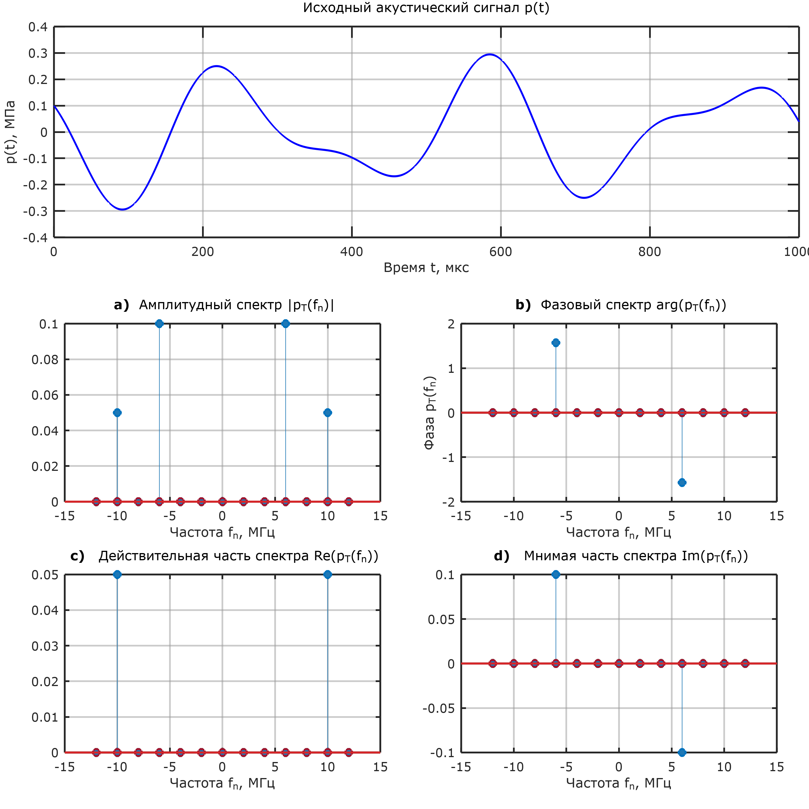
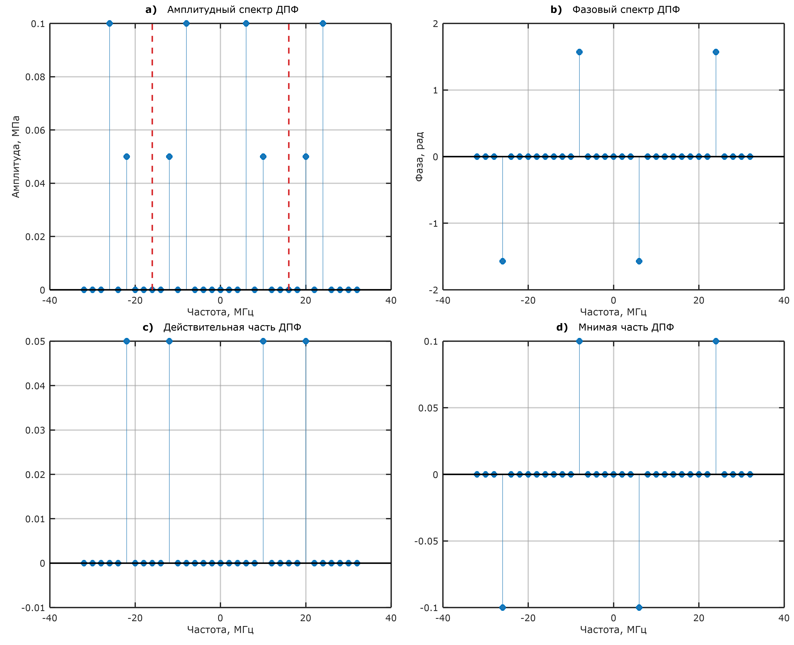
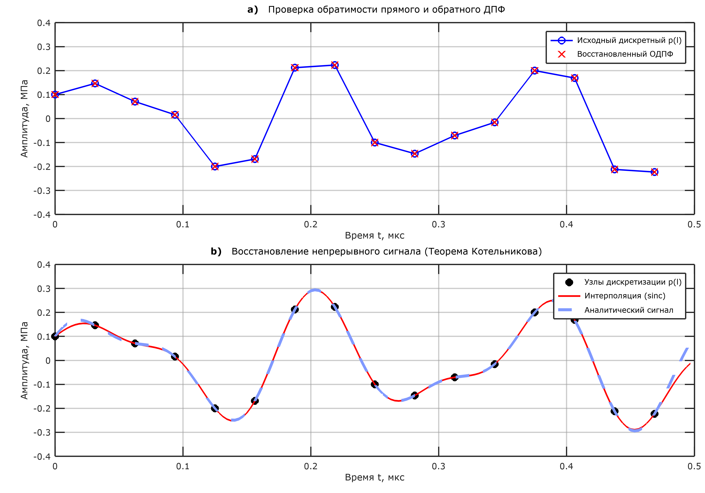
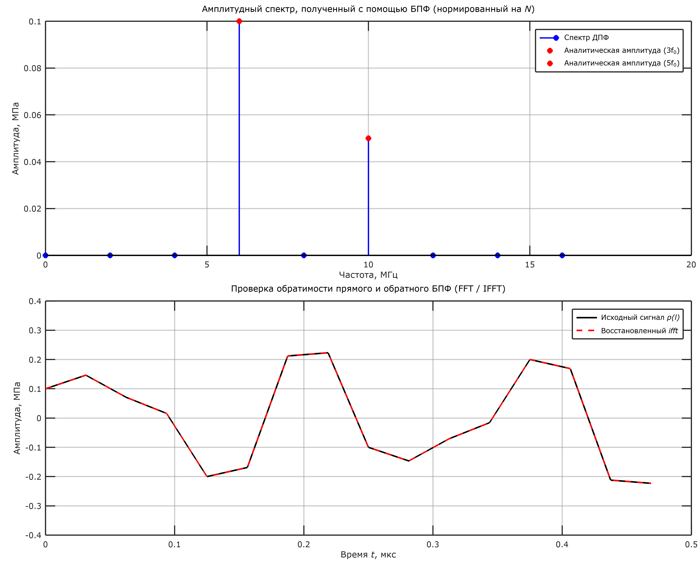
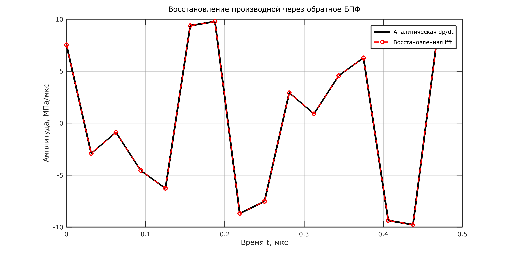
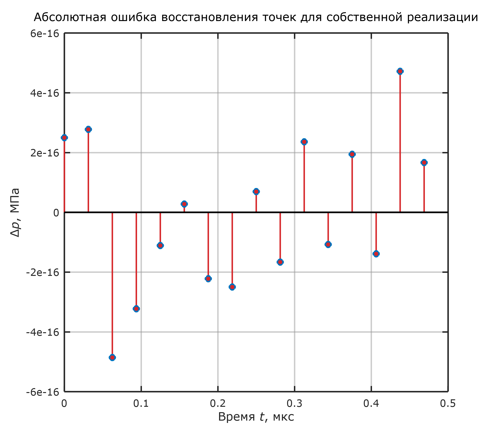
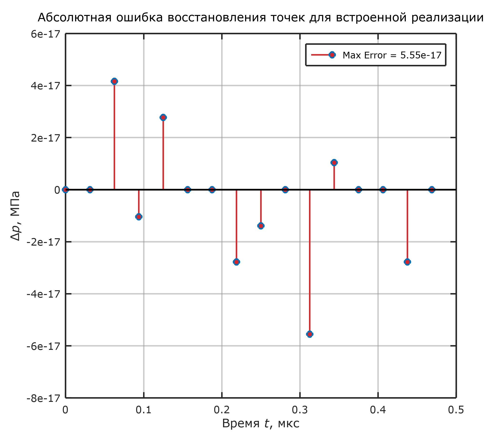

<!-- class: lead -->

# Дискретное преобразование Фурье
## и теорема Котельникова-Шеннона

**Самостоятельная работа. Вариант 1**
*Парфенов Михаил, 424 группа*

---

<!-- class: "" -->
## 1. Постановка задачи

Требуется исследовать акустический сигнал, описываемый бигармонической функцией:

$$
p(t) = 2a_0 \sin(3\omega_0 t) + a_0 \cos(5\omega_0 t)
$$

**Заданные параметры системы:**
* Амплитуда: $a_0 = 0.1$ МПа
* Базовая частота: $f_0 = 2$ МГц
* Круговая частота: $\omega_0 = 2\pi f_0$

**Цель работы:** 
Реализация алгоритмов ДПФ/ОДПФ, интерполяция сигнала и спектральное дифференцирование.

---


<style scoped>
section { font-size: 20px; }
h2 { font-size: 28px; }
</style>

## 2. Аналитический спектр

**Гармоники:** $f_1 = 6$ МГц, $f_2 = 10$ МГц.
**Период:** $T = 1 / НОД = \mathbf{0.5 \text{ мкс}}$.

**Амплитуды:**
* $\pm 6$ МГц: $\mp 0.1i$
* $\pm 10$ МГц: $0.05$

**Симметрия:**
* $|P|$ и $\text{Re}$ — **четные**.
* $\arg$ и $\text{Im}$ — **нечетные**.

---


## 3. Выбор параметров дискретизации

Согласно **теореме Котельникова-Шеннона**:
$$ f_s > 2f_{max} \implies f_s > 20 \text{ МГц} $$

**Расчет сетки:**
* Шаг дискретизации: $h \le 0.05$ мкс.
* Окно дискретизации: $T = 0.5$ мкс.
* Минимальное число точек: $N^* = T/h = 10$.

Для оптимизации алгоритма БПФ выбрано ближайшее число, являющееся степенью двойки: **$N = 16$**. 
*(Фактический шаг: $h = 0.03125$ мкс, $f_s = 32$ МГц).*

---


<style scoped>
section { font-size: 20px; }
h2 { font-size: 28px; }
</style>

## 4. Собственная реализация ДПФ

Вычисление спектра:
$$ \overline{p_T(n)} = \frac{1}{N} \sum_{l=0}^{N-1} p(l) \exp\left(-i \frac{2\pi nl}{N} \right) $$

**Оптимизация:**
Рассчитывалась только первая половина спектра ($0 \dots N/2$). Вторая получена сопряжением:
$$ p_T(N - n) = p_T^*(n) $$

*Амплитуды в 2 раза меньше аналитических из-за двустороннего спектра.*

---



<style scoped>
section { font-size: 20px; }
h2 { font-size: 28px; }
</style>

## 5. Обратное ДПФ и Интерполяция

**Восстановление:**
$$ p(l) = \sum_{n=0}^{N-1} \overline{p_T(n)} \exp\left( i\frac{2\pi nl}{N} \right) $$

**Теорема Котельникова:**
Реконструкция непрерывного сигнала:
$$ p(t) = \sum_{l=0}^{N-1} p(l)\operatorname{sinc}\left[ \frac{\pi}{h}(t - lh) \right] $$

*Ошибка восстановления $\sim 10^{-16}$.*

---



<style scoped>
section { font-size: 20px; }
h2 { font-size: 28px; }
</style>

## 6. Встроенные алгоритмы FFT

Использованы функции `fft` и `ifft`.

**Масштабирование:**
Встроенные алгоритмы вычисляют ненормированную сумму. Для получения физических амплитуд применен коэффициент $1/N$:
$$ P_{physical} = \frac{fft(p)}{N} $$

*Алгоритмы составляют обратимую пару (ошибка $\sim 10^{-17}$).*

---


## 7. Дополнительная задача: Дифференцирование

Дифференцирование сигнала во временной области эквивалентно умножению его спектра на $i\omega$ в частотной:
$$ \frac{dp(t)}{dt} \Longleftrightarrow i\omega_n \cdot P(\omega_n) $$

**Алгоритм реализации:**
1. Прямое БПФ исходного сигнала.
2. Формирование вектора частот $\omega_n$ с учетом отрицательной полуоси.
3. Умножение: $P'_{fft} = P_{fft} \cdot (i\omega_n)$.
4. Обратное БПФ: $p' = real(ifft(P'_{fft}))$.

---


<style scoped>
section { font-size: 20px; }
h2 { font-size: 28px; }
</style>


## Результат дифференцирования

Сигнал успешно продифференцирован в частотной области.

Восстановленная производная $dp/dt$ совпадает с аналитически вычисленной производной.

Максимальная ошибка восстановления составляет $\sim 10^{-14}$ МПа/мкс.

---
<style scoped>
h2, p { text-align: center; }


.images {
  display: flex;
  justify-content: space-between;
  align-items: center;
  margin-top: 40px;
}

.images img {
  width: 32%; 
}
</style>

## Анализ точности восстановления

$$ \Delta p(t) = p_{restored}(t) - p_{original}(t) $$

<div class="images">
  
  
</div>

---


<style scoped>
section { font-size: 22px; }
h2 { font-size: 32px; }
pre { font-size: 16px; margin-top: 0; }
.columns { display: flex; gap: 20px; }
.col { flex: 1; }
</style>

## Эмуляция стиля Matplotlib в MATLAB

Дефолтные графики MATLAB (Octave) выглядят устаревшими. Чтобы отчет выглядел современно, стиль **Matplotlib** был воссоздан "с нуля" через глобальные настройки (аналог `plt.rcParams`).

<div class="columns">
<div class="col">

**Главные хаки:**
1. **Цветовая палитра:** Вручную заданы RGB-коды дефолтных питоновских цветов (Tableau 10). Знакомый синий `C0` = `[0.12, 0.47, 0.71]`.
2. **Шрифты:** Жирность заголовков принудительно отключена (`normal`), установлен питоновский шрифт `DejaVu Sans`.
3. **Стемы:** Магический параметр `'filled'` в функции `stem()` закрашивает пустые кружки.
4. **Базовая линия:** В Octave красная ось $Y=0$ реализуется отрисовкой дополнительной линии: `plot(xlim, [0 0], 'r')`.

</div>
<div class="col">

**Фрагмент конфигурации (MATLAB):**
```matlab
% Задаем цвета Python (C0 и C3)
mpl_blue = [0.12, 0.47, 0.71];
mpl_red  = [0.84, 0.15, 0.16];

% Настройки шрифтов и фона
set(0, 'DefaultFigureColor', 'w');
set(0, 'DefaultTextFontName', 'DejaVu Sans');
set(0, 'DefaultAxesTitleFontWeight', 'normal');

% Делаем сетку сплошной и полупрозрачной
set(0, 'DefaultAxesGridLineStyle', '-');
set(0, 'DefaultAxesGridColor', [0.6 0.6 0.6]);

% Рисуем красивый stem
stem(freqs, amp, 'filled', 'Color', mpl_blue);
```
</div>
</div>

---

<!-- class: lead -->

# Спасибо за внимание!
### Готов ответить на ваши вопросы.

*Примеры вопросов*:
1) когда отменят карантин на фф
2) как сделать такую же классную презентацию